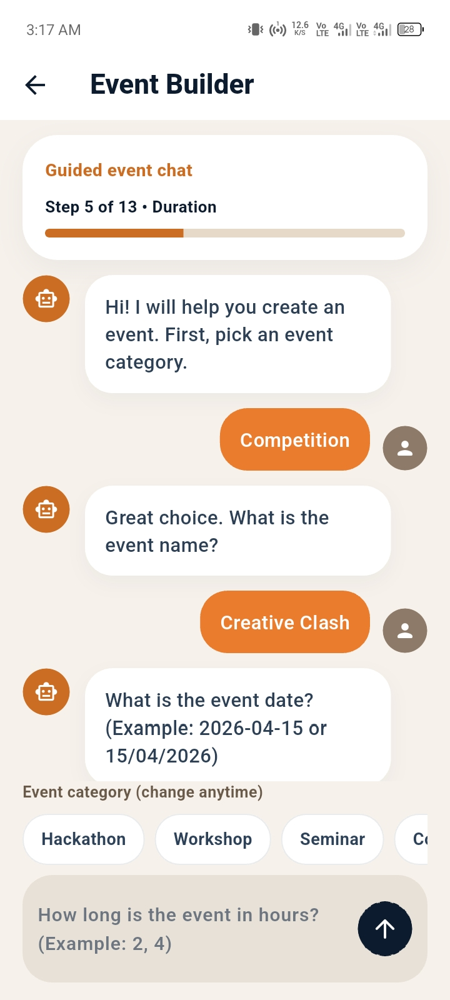
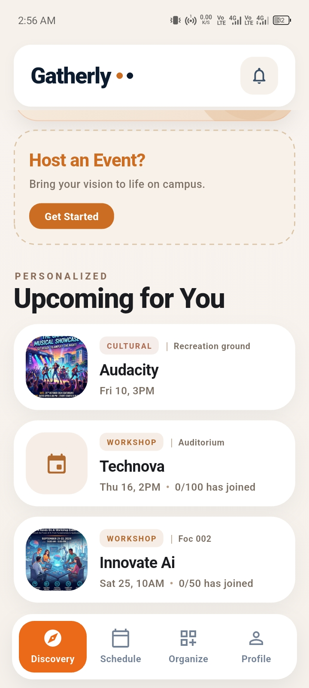
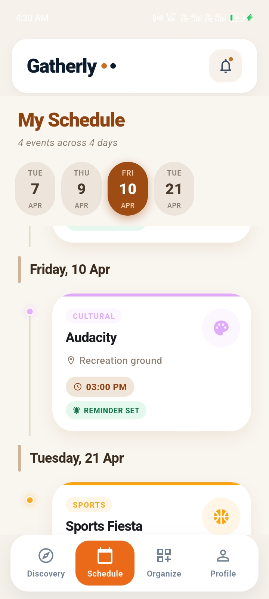
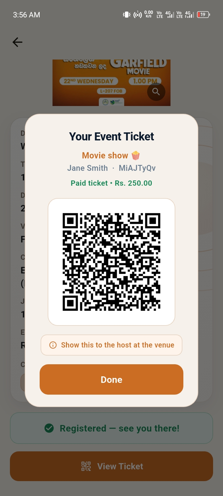
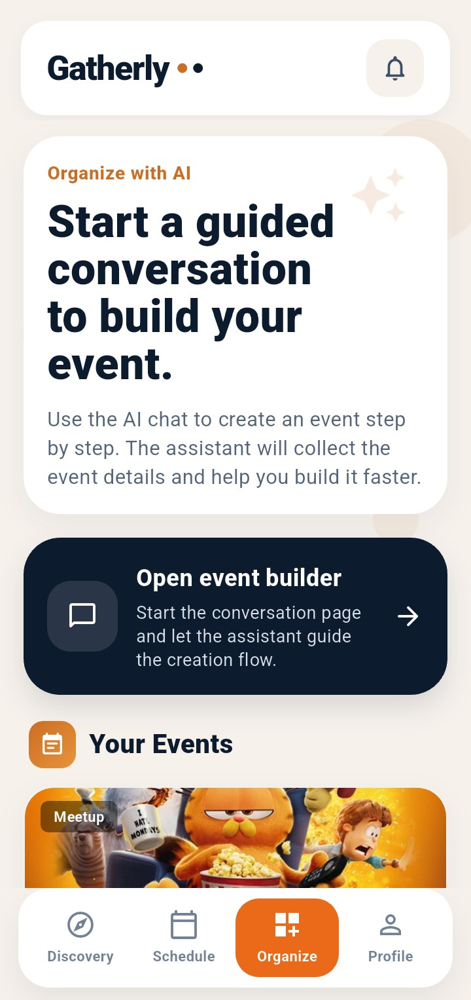
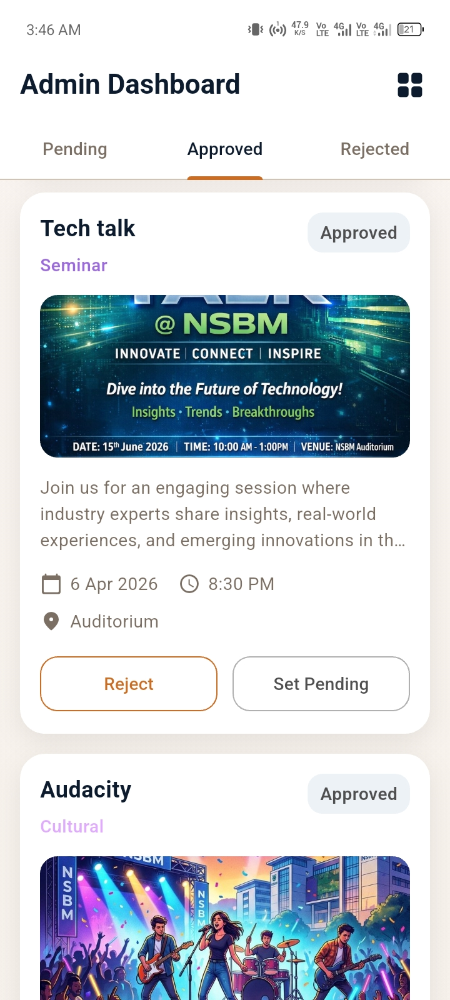
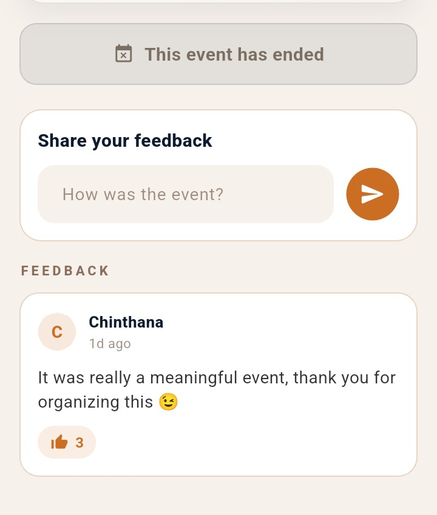
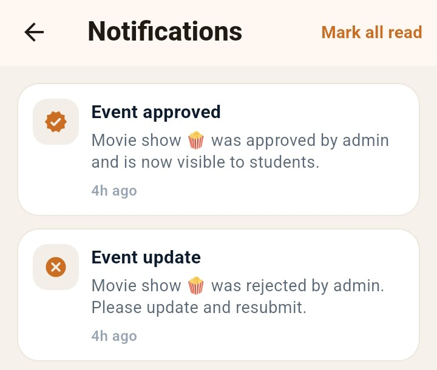

<div align="center">


# Gatherly
### *Campus Event Management, Generative AI Event Builder & Real-Time Ticketing Platform*

[](https://flutter.dev/)
[](https://dart.dev/)
[](https://firebase.google.com/)
[](https://aistudio.google.com/)
[](https://developer.paypal.com/)
[](https://www.android.com/)
[](LICENSE)

<br/>

### 🎓 University Coursework Project
**Academic Module:** 2nd Year — Mobile Application Development  
**Core Competencies:** Mobile application engineering (Flutter/Dart), Generative AI integration (Google Gemini), real-time NoSQL streams (Firebase BaaS), and role-based multi-tenant architecture.

<br/>

**A production-grade mobile application built with Flutter engineered to streamline campus life by connecting students, event organizers, and club administrators through conversational AI event generation, interactive scheduling calendars, digital QR ticketing, and real-time community engagement.**

<br/>

</div>

---

## 📌 Executive Summary

Campus event organization is frequently undermined by fragmented communication—scattered social media groups, paper flyers, disjointed registration spreadsheets, and manual attendance tracking. Students miss important activities due to lack of centralized discovery, while organizers struggle with tedious event setup, ticketing logistics, and attendee validation.

**Gatherly** solves this by delivering an all-in-one mobile platform featuring:
1. **Students**: Frictionless event discovery with category filters, interactive calendar scheduling, conversational AI event creation, digital QR ticket passes, and live interactive Q&A during events.
2. **Organizers & Clubs**: Streamlined event hosting tools with AI-assisted drafting, co-host delegation, ticket capacity controls, and real-time attendee feedback monitoring.
3. **Campus Administrators**: Centralized governance dashboard to review event approval requests, oversee university clubs, track engagement metrics, and enforce safety protocols.

---

## 📱 Feature Walkthrough & Visual Showcase

---

### 🤖 1. Conversational AI Event Builder *(Flagship Feature)*

Organizing an event often involves tedious form filling. Gatherly integrates **Google Gemini Generative AI** (`google_generative_ai`) to let organizers generate comprehensive event drafts using natural conversational prompts:

* **Contextual Turn Analysis**: The Gemini-powered assistant dynamically classifies intent, validates constraints, and extracts event parameters (title, category, date, start time, venue, duration, and participant caps) from casual conversation.
* **Smart Draft Synthesis**: Iteratively refines event details as the user chats, offering intelligent suggestions for descriptions and scheduling before final publication.
* **Instant Form Pre-population**: Converted structured JSON outputs seamlessly populate the event creation pipeline with one tap.

<br/>

<div align="center">
  
  <p align="center"><sub><b>Figure 1:</b> AI Chat Event Assistant leveraging Google Gemini to synthesize structured event parameters from natural language prompts.</sub></p>
</div>

<br/>

---

### 🔍 2. Event Discovery & Interactive Calendar Schedule

Gatherly provides students with intuitive browsing and schedule planning experiences tailored to academic calendars:

* **Categorized Discovery Feed**: Real-time Firestore stream showcasing trending events, upcoming university happenings, category pills (Tech, Sports, Arts, Academic), and search filtering.
* **Synchronized Calendar Schedule**: Built on `table_calendar`, allowing attendees to view upcoming schedules in monthly, bi-weekly, or daily agenda views with registered event markers.
* **One-Tap Event Bookmarking**: Save events directly to a personal agenda with instant schedule conflict detection.

<br/>

<div align="center">
<table>
  <tr>
    <td width="50%" align="center">
      
    </td>
    <td width="50%" align="center">
      
    </td>
  </tr>
  <tr>
    <td align="center"><sub><b>Figure 2A:</b> Discovery feed with category filters, search bar, and trending event cards.</sub></td>
    <td align="center"><sub><b>Figure 2B:</b> Interactive monthly calendar view highlighting registered events and daily agendas.</sub></td>
  </tr>
</table>
</div>

<br/>

---

### 🎟️ 3. Digital E-Ticketing & Live QR Check-In *(Flagship Feature)*

Paper tickets and manual sign-in sheets cause long registration bottlenecks. Gatherly replaces physical passes with high-security, dynamic digital credentials:

* **Unique Digital Ticket Passes**: Upon registration, an encrypted digital pass is generated containing attendee details, seat/tier allocations, and unique cryptographic IDs.
* **Real-Time QR Validation**: Organizers scan tickets using the integrated mobile camera scanner (`mobile_scanner`), executing sub-second Firestore lookups to prevent duplicate admissions.
* **Integrated Payment Processing**: For premium workshops and concerts, seamless checkout is handled via an integrated PayPal payment gateway (`flutter_paypal`), generating confirmed digital tickets instantly upon transaction settlement.

<br/>

<div align="center">
  
  <p align="center"><sub><b>Figure 3:</b> Attendee digital event ticket with high-resolution QR verification pass and booking details.</sub></p>
</div>

<br/>

---

### 🏢 4. Event Organizer Hub & Administrative Governance

Gatherly empowers university organizations with self-service hosting and comprehensive administrative oversight:

* **Organizer Management Hub**: Central console for hosts to manage published events, monitor participant counts against capacity limits, review drafts, and coordinate with co-hosts.
* **Admin Governance Dashboard**: Privileged administrative portal to review pending club events, grant approvals, manage campus club directories, and enforce institution guidelines.
* **Dynamic Approval Workflows**: State transitions (`pending` ➔ `accepted` / `rejected`) update in real-time across user feeds without requiring app restarts.

<br/>

<div align="center">
<table>
  <tr>
    <td width="50%" align="center">
      
    </td>
    <td width="50%" align="center">
      
    </td>
  </tr>
  <tr>
    <td align="center"><sub><b>Figure 4A:</b> Organizer hub for managing live events, tracking RSVPs, and publishing new sessions.</sub></td>
    <td align="center"><sub><b>Figure 4B:</b> Administrative dashboard for club oversight, event moderation, and institutional governance.</sub></td>
  </tr>
</table>
</div>

<br/>

---

### 💬 5. Real-Time Attendee Engagement & Notifications

Community interaction continues beyond registration through live interaction tools:

* **Live Q&A & Feedback Stream**: Built directly into event sessions, enabling attendees to post questions, submit live feedback, and interact with speakers in real-time.
* **Automated Notification Hub**: Instant local and cloud alerts powered by `flutter_local_notifications` for event reminders, venue updates, approval notices, and schedule announcements.

<br/>

<div align="center">
<table>
  <tr>
    <td width="50%" align="center">
      
    </td>
    <td width="50%" align="center">
      
    </td>
  </tr>
  <tr>
    <td align="center"><sub><b>Figure 5A:</b> Real-time Q&A stream and interactive feedback module for live event attendees.</sub></td>
    <td align="center"><sub><b>Figure 5B:</b> Notification center delivering automated event reminders, host alerts, and status changes.</sub></td>
  </tr>
</table>
</div>

<br/>

---

## 🏗️ Architecture & Software Design

Gatherly is engineered using a clean, layered architecture separating reactive presentation widgets, stateful business services, and external BaaS/API gateways:

```
┌────────────────────────────────────────────────────────────────────────┐
│                          Presentation Layer                            │
│   Student Discovery  •  Calendar Schedule  •  Admin Governance Portal │
│   Gemini AI Builder  •  QR Scanner / Pass  •  Live Q&A & Feedback      │
│             (Material 3 Design • StreamBuilder & FutureBuilder)        │
└───────────────────────────────────┬────────────────────────────────────┘
                                    │ Reactive Streams & State Dispatch
┌───────────────────────────────────▼────────────────────────────────────┐
│                             Service Layer                              │
│   auth_service.dart          •  gemini_event_assistant_service.dart    │
│   event_service.dart         •  paypal_checkout_service.dart           │
│   notification_service.dart  •  qr_service / permission handlers       │
└───────────────────────────────────┬────────────────────────────────────┘
                                    │ Asynchronous API & Data Binding
┌───────────────────────────────────▼────────────────────────────────────┐
│                         Cloud & External Services                      │
│   Firebase Auth (Google OAuth)  •  Cloud Firestore (Live Streams)      │
│   Firebase Storage (Posters)    •  Google Gemini AI (1.5 Flash API)    │
│   PayPal REST Sandbox API       •  Local Notifications Plugin          │
└────────────────────────────────────────────────────────────────────────┘
```

### Architectural Highlights

* **Role-Based Authentication Shell (`auth_shell_screen.dart`)**:
  Wraps the app with a continuous `FirebaseAuth` state listener. Upon sign-in, the system queries Firestore to inspect the user's role and automatically directs them to either the Student Experience or Admin Governance portal.
* **Reactive Stream Architecture**:
  Utilizes Firestore real-time snapshots bound to Flutter `StreamBuilder` widgets. Live RSVP counts, Q&A comment streams, and administrative approval flags update instantly without polling.
* **LLM Prompt Engineering & JSON Schema Enforcement**:
  The `GeminiEventAssistantService` employs structured system instructions, few-shot prompt framing, and JSON extraction regex patterns to reliably map LLM output into typed Dart `EventModel` properties.
* **Decoupled Service-Repository Pattern**:
  Presentation screens never interact with external SDKs directly. Domain services (`EventService`, `AuthService`, `NotificationService`) encapsulate all CRUD operations and error handling.

---

## 💻 Technology Stack

| Layer / Component | Technology | Architectural Rationale |
|---|---|---|
| **Mobile Framework** | **Flutter 3 (Dart 3)** | Native mobile compilation with high-performance 60fps UI rendering. |
| **Authentication** | **Firebase Auth & Google Sign-In** | Multi-tenant role authentication, secure JWT handling, and seamless OAuth onboarding. |
| **Cloud Database** | **Cloud Firestore** | Low-latency document NoSQL persistence with real-time reactive stream listeners. |
| **Generative AI** | **Google Gemini (`google_generative_ai`)** | Intelligent conversational agent for natural language event drafting and intent parsing. |
| **Ticketing & Scanning** | **QR Flutter & Mobile Scanner** | Dynamic vector QR code rendering paired with high-speed camera hardware barcode scanning. |
| **Payment Gateway** | **PayPal (`flutter_paypal`)** | Verified digital payment settlement for ticketed university events and workshops. |
| **Calendar Engine** | **TableCalendar** | Highly customizable monthly/weekly calendar widget with custom day-marker builders. |
| **Push Notifications** | **Flutter Local Notifications** | Automated scheduled background alerts and event milestone push notifications. |
| **Environment Hygiene** | **Flutter Dotenv** | Isolation of third-party API keys and environment configurations from source code. |

---

## 🚀 Getting Started & Local Setup

### Prerequisites

* [Flutter SDK](https://docs.flutter.dev/get-started/install) (Version 3.0.0 or higher)
* [Dart SDK](https://dart.dev/get-dart) (bundled with Flutter)
* [Android Studio](https://developer.android.com/studio) or VS Code with Flutter extension
* Configured Android Emulator or physical device with USB debugging enabled

### Installation & Run

1. **Clone the repository:**
   ```bash
   git clone https://github.com/chinthanasathyajithcs/gatherly-event-management-mobile-app.git
   cd gatherly-event-management-mobile-app
   ```

2. **Install Flutter packages:**
   ```bash
   flutter pub get
   ```

3. **Configure Environment Keys:**
   * Create a `.env` file in the project root:
     ```bash
     cp .env.example .env
     ```
   * Populate your credentials:
     ```env
     FIREBASE_PROJECT_ID=your-firebase-project-id
     FIREBASE_API_KEY=your-firebase-api-key
     FIREBASE_APP_ID=your-firebase-app-id
     FIREBASE_MESSAGING_SENDER_ID=your-firebase-sender-id
     FIREBASE_STORAGE_BUCKET=your-project.firebasestorage.app
     GEMINI_API_KEY=your-gemini-api-key
     PAYPAL_CLIENT_ID=your-paypal-client-id
     PAYPAL_SECRET=your-paypal-secret-key
     PAYPAL_SANDBOX=true
     ```

4. **Add Firebase Android Configuration:**
   * Place your `google-services.json` file inside `android/app/`.

5. **Launch the Application:**
   ```bash
   flutter run
   ```

---

## 📄 License

This project is licensed under the [MIT License](LICENSE).
